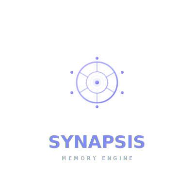

<p align="center">
  
</p>
<p align="center">
  <b>Persistent Memory Engine for AI Agents</b>
</p>

<p align="center">
  
  
  
  
  
  
  
</p>

# Synapsis

> `/ˈsɪnæpsɪs/` — the structure that enables neurons to communicate.

**Synapsis** is a pure Rust persistent memory engine for AI agents with post-quantum cryptography (PQC), multi-agent orchestration, and native MCP protocol integration. Zero Python dependencies.

---

## Features

- **Persistent Memory** — SQLite-backed with FTS5 full-text search and BM25 ranking
- **Post-Quantum Security** — CRYSTALS-Kyber-512 KEM + CRYSTALS-Dilithium-2 signatures + AES-256-GCM at rest
- **Inter-Agent Event Bus** — Real-time messaging between agents via persistent `events` table
- **60+ MCP Tools** — Memory, events, agents, tasks, security, resource management
- **Multi-Client Support** — OpenCode, Claude Code, Cursor, VS Code, JetBrains, Windsurf, Gemini CLI
- **Cross-Platform** — Linux, macOS, Windows, Android (Termux)
- **Zero Python** — Pure Rust ecosystem
- **Auto-Migration** — Database schema migrates automatically across versions via `PRAGMA user_version`

---

## Quick Start

```bash
# Automatic install
curl -fsSL https://raw.githubusercontent.com/methodwhite/synapsis/main/install.sh | bash

# Or build from source
git clone https://github.com/methodwhite/synapsis.git
cd synapsis
cargo build --release

# Run MCP server (stdio)
synapsis mcp

# Or serve HTTP REST API
synapsis serve --port 7439
```

---

## Architecture

```
CLI (opencode, qwen)   IDE (vscode, cursor)   TUI (mw-cli)
         │                       │                   │
         └───────────────────────┼───────────────────┘
                                 │
                        MCP JSON-RPC (stdio)
                                 │
            ┌────────────────────▼────────────────────┐
            │            SYNAPSIS ENGINE               │
            │  Memory │ Events │ Agents │ Tasks        │
            ├──────────────────────────────────────────┤
            │  Security: PQC · SQLCipher · Rate Limit  │
            │  Resources: Monitor · Throttle · Limits  │
            └────────────────────┬─────────────────────┘
                                 │
                   SQLite + FTS5 + SQLCipher
                   events table (inter-agent bus)
```

---

## MCP Tools (60+)

| Category | Tools |
|----------|-------|
| **Memory** | `mem_save`, `mem_search`, `mem_context`, `mem_timeline`, `mem_update`, `mem_delete` |
| **Events** | `send_message`, `get_pending_messages`, `broadcast`, `event_poll` |
| **Agents** | `agent_heartbeat`, `agent_details`, `task_create`, `task_claim`, `task_complete` |
| **Security** | `security_classify`, `security_sanitize_input`, `pqc_encrypt`, `cve_search`, `security_audit` |
| **Resources** | `resource_snapshot`, `resource_limits`, `mem_lock_acquire`, `mem_lock_release` |

---

## Version History

| Version | Date | Highlights |
|---------|------|------------|
| **v0.5.0** | 2026-06-12 | Auto DB migration via `PRAGMA user_version`. Persistent storage in MCP mode. Synapsis logo. |
| **v0.4.0** | 2026-06-10 | MCP bridge mode removed. Async stdio MCP server. `synapsis-core` crate refactor. |
| **v0.3.0** | 2026-06-02 | PQC integration (Kyber + Dilithium). Memory search with FTS5. Multi-agent event bus. |
| **v0.2.0** | 2026-05-20 | MCP protocol support. SQLite backend. Agent orchestration. Task queue system. |
| **v0.1.0** | 2026-05-10 | Initial prototype. CLI memory management. Basic SQLite storage. |

## Documentation

- [CHANGELOG.md](CHANGELOG.md) — Detailed version history and release notes
- [CONTRIBUTING.md](CONTRIBUTING.md) — Contribution guidelines
- [SECURITY.md](SECURITY.md) — Security policy
- [SPEC.md](SPEC.md) — Technical specification
- [docs/](docs/) — Architecture and security documentation

---

## License

**BUSL-1.1** (Business Source License 1.1). Personal, educational, and research use. Commercial use requires license.

Contact: methodwhite@proton.me

---

**Built with Rust by MethodWhite**
