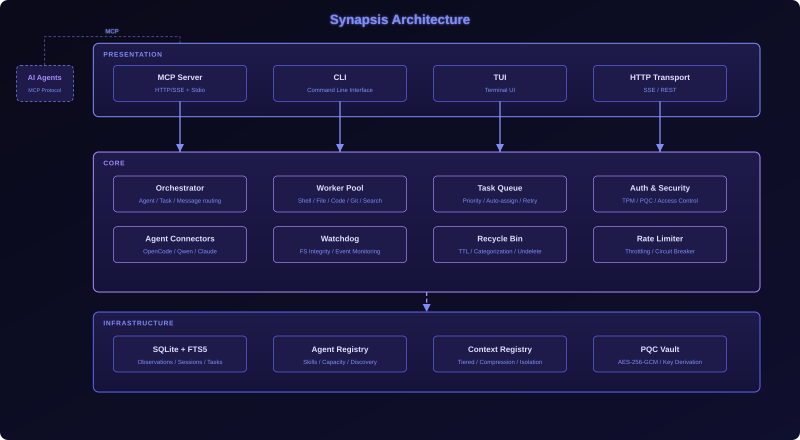

<p align="center">
  
</p>

<h1 align="center">Synapsis</h1>

<p align="center">
  <strong>Persistent Memory Engine for AI Agents</strong>
  <br>
  <sub>Built with Rust. MCP-native. Zero-trust security.</sub>
</p>

<p align="center">
  <a href="https://www.rust-lang.org"></a>
  <a href="LICENSE"></a>
  <a href="https://github.com/MethodWhite/synapsis"></a>
</p>

Synapsis is a persistent memory engine for AI agents. It implements the [Model Context Protocol (MCP)](https://modelcontextprotocol.io) to give LLM agents durable, searchable memory across sessions. Written in pure Rust with SQLite + FTS5 storage and optional post-quantum cryptography.

---

## Quick Start

```bash
git clone https://github.com/methodwhite/synapsis.git
cd synapsis
cargo build --release

# MCP server (stdio) - for local AI agents
./target/release/synapsis-mcp

# Multi-agent MCP server (HTTP/SSE)
./target/release/synapsis
```

**Prerequisites:** Rust 1.75+ ([install](https://rustup.rs))

---

## Installation

### Linux / macOS

```bash
# Linux (x86_64 / ARM64)
curl -fsSL https://raw.githubusercontent.com/methodwhite/synapsis/main/scripts/install-linux.sh | bash

# macOS (Intel / Apple Silicon)
curl -fsSL https://raw.githubusercontent.com/methodwhite/synapsis/main/scripts/install-macos.sh | bash
```

### Windows (PowerShell)

```powershell
# Run as Administrator
iwr -Uri https://raw.githubusercontent.com/methodwhite/synapsis/main/scripts/install.ps1 -OutFile install.ps1
.\install.ps1
```

### Build from Source (all platforms)

```bash
git clone https://github.com/methodwhite/synapsis.git
cd synapsis
cargo build --release
```

The build produces three binaries:
| Binary | Purpose |
|--------|---------|
| `synapsis` | Multi-agent MCP server (HTTP/SSE) |
| `synapsis-mcp` | Single-agent MCP server (stdio) |
| `synapsis-server` | HTTP API server |

---

## Features

- **Persistent Memory** — Save, search, and retrieve observations with full-text search (FTS5 + BM25 ranking)
- **MCP-native** — Drop-in compatible with any MCP client (Claude Code, Cursor, Windsurf, OpenCode, Qwen)
- **Multi-agent** — Shared database, distributed locking, task queues for concurrent agent workflows
- **Context Management** — Tiered context with compression, isolation, and automatic budget tracking
- **Security** — Optional SQLCipher encryption at rest, integrity hashing, TPM-backed MFA, PQC encryption
- **Watchdog** — Filesystem integrity monitoring with event auditing and anomaly detection
- **Anti-Brick** — Protection against destructive system commands
- **Recycle Bin** — TTL-based categorization with search and undelete
- **Cross-platform** — Linux, macOS, Windows (WSL2 or native MSVC)

---

## Architecture

<p align="center">
  
</p>

The system follows a hexagonal (ports & adapters) architecture with three layers:

- **Presentation** — MCP stdio/HTTP, CLI, TUI interfaces
- **Core** — Business logic (orchestrator, workers, task queue, auth, watchdog, recycle)
- **Infrastructure** — SQLite + FTS5 storage, agent registry, context management, PQC vault

---

## MCP Tools

| Tool | Description |
|------|-------------|
| `mem_save` | Save an observation to persistent memory |
| `mem_search` | Search persistent memory across all sessions |
| `mem_context` | Get recent context from current or previous sessions |
| `mem_timeline` | Get chronological timeline of observations |
| `mem_stats` | Get memory statistics |
| `mem_delete` | Delete an observation by ID (soft-delete) |
| `memory_search` | [alias] Search Synapsis persistent memory |
| `memory_add` | [alias] Add observation to Synapsis |
| `memory_timeline` | [alias] Get memory timeline |
| `memory_stats` | [alias] Get memory statistics |
| `agent_register` | Register a new agent |
| `agent_list` | List all registered agents |
| `task_create` | Create a new task |
| `task_list` | List all tasks |
| `skill_register` | Register a new skill |
| `skill_list` | List all registered skills |
| `ghost_audit` | Trigger proactive audit of a file or path |
| `pqc_encrypt` | Encrypt sensitive data using Post-Quantum Cryptography |
| `wasm_run` | Run a sandboxed WASM skill |
| `antibrick_scan` | Scan a command for potential brick threats |
| `antibrick_enable` | Enable or disable anti-brick protection |
| `antibrick_stats` | Get anti-brick protection stats |
| `watchdog_stats` | Get filesystem watchdog stats |
| `watchdog_verify` | Verify integrity of monitored files |
| `watchdog_snapshot` | Create integrity snapshot of a path |
| `watchdog_events` | Get recent watchdog events |
| `watchdog_check_path` | Check if a path is protected by watchdog |
| `browser_navigate` | Fetch a web page as an HTTP client |
| `browser_snapshot` | Get a structured snapshot of a web page |
| `mcp_call` | Call a tool on another MCP server via HTTP |
| `db_backup` | Create a backup of the Synapsis database |
| `db_integrity` | Run PRAGMA integrity_check on the database |
| `db_prune` | Soft-delete observations older than N days |
| `db_vacuum` | Reclaim unused space in the database |

---

## Storage

Synapsis uses **SQLite** with **FTS5** full-text search for all persistent storage:

- **Observations** — Title, content, project, type, scope, integrity hash
- **Sessions** — Agent session lifecycle tracking with activity timelines
- **Task Queue** — Multi-agent task coordination with priority and retry
- **Agent Registry** — Agent skills, capacity, and discovery
- **Context Registry** — Tiered context with hot/warm/cold states and compression
- **Locks** — Distributed mutex for concurrent agent access

---

## IDE Integration

| Platform | Setup |
|----------|-------|
| **VS Code / Cursor / Windsurf** | Config from `plugins/vscode/` |
| **Claude Code** | Plugin from `plugins/claude-code/` |
| **JetBrains** | Plugin from `plugins/jetbrains/` |
| **Gemini CLI** | Script from `plugins/gemini-cli/` |

---

## Environment Variables

| Variable | Description |
|----------|-------------|
| `SYNAPSIS_DB_KEY` | Hex-encoded encryption key (SQLCipher) |
| `SYNAPSIS_DB_KEY_BASE64` | Base64-encoded encryption key |
| `SYNAPSIS_DATA_DIR` | Custom data directory (default: `~/.local/share/synapsis`) |
| `SYNAPSIS_QUIET` | Suppress informational output |
| `SYNAPSIS_LOG` | Set log level (debug, info, warn, error) |
| `SYNAPSIS_API_KEYS` | Comma-separated API keys for auth |
| `SYNAPSIS_PORT` | HTTP server port (default: 7438) |

---

## Documentation

| Document | Description |
|----------|-------------|
| [Architecture](assets/architecture.drawio) | System architecture diagram (draw.io) |
| [Multi-Agent](docs/MULTI-AGENT.md) | Multi-agent coordination and orchestration |
| [Deployment](docs/DEPLOYMENT_GUIDE.md) | Production deployment guide |
| [YOLO Mode](docs/YOLO_MODE.md) | Autonomous operation mode |
| [Roadmap](docs/ROADMAP.md) | Development roadmap |

---

## License

Business Source License 1.1 — see [LICENSE](LICENSE) for details.

Commercial use requires a separate license for entities with 3+ employees or over $100k annual revenue. Non-commercial, educational, and personal use is free. Changes to Apache 2.0 on March 23, 2030.

---

<p align="center">
  <sub>Built with Rust by MethodWhite</sub>
</p>
